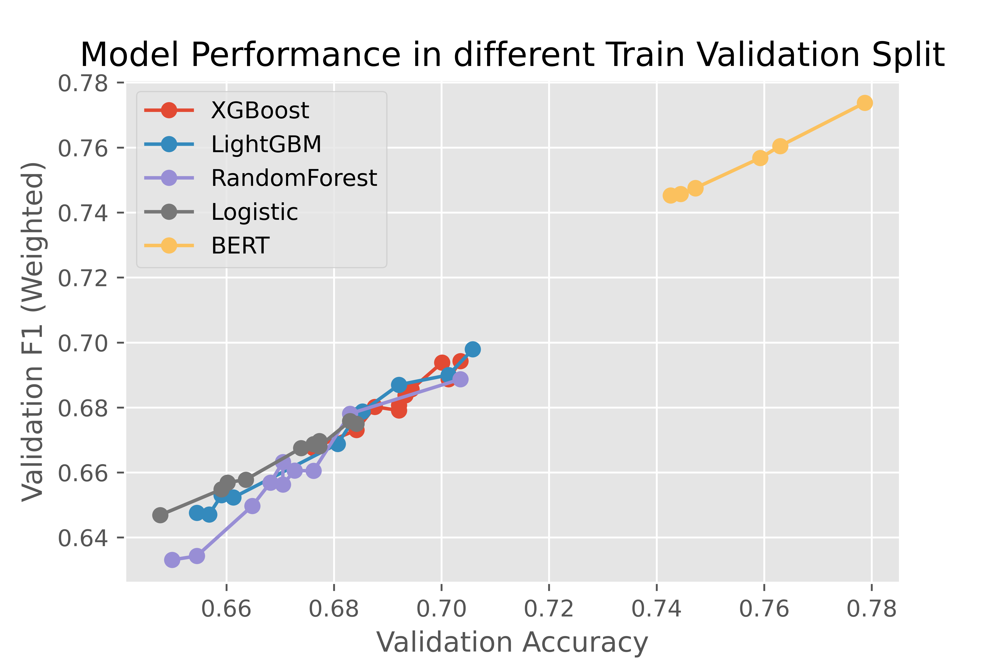

# datahack2022-advanced

Author: Zixin Ma, Sheng Yang

In this datahack project, we empirically demonstrate the superiority of transformer-based models on sentiment analysis tasks. Comparing different models, BERT is the best performing one in both accuracy and f1 score.

We also proposed looking at an asymmetric custom loss function for further improvements, since financial practioners are more interested in capturing all long and short opportunities.

Competition Result: Won the first place, had 76% accuracy on the test set. 

Last Update: 04/21/2022

Project Demo: Model performance in different train validation splits for all tested models.

